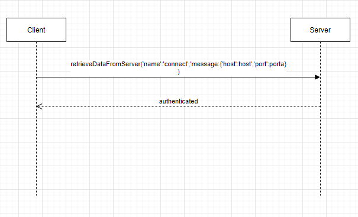
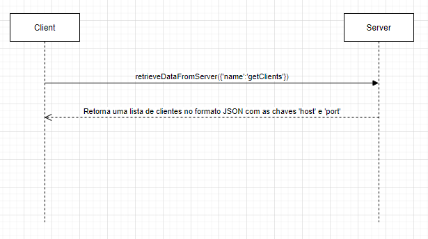
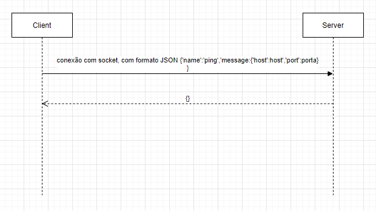
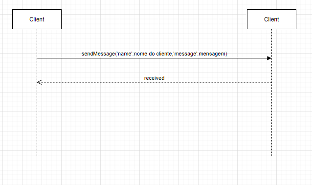

# Sala de bate papo

## Equipe

- **Adrian Grosch**
- **Matheus Parro de Sousa**

## Cenário Base

O sistema consiste numa sala de bate papo peer to peer através de sockets em conjunto com threads. Para entrar na sala,
cada cliente deve informar sua scredenciais (porta privada, host e porta publica) e os dados do servidor (host e porta)
, para que o mesmo aceite a conexão do socket. Cada cliente logado pode enviar mensagens a todos os participantes. Tal
comunicação acontece através de JSONs com a chave "name" e "message", sendo respectivamente o nome do cliente que está
enviando a mensagem e message o conteúdo digitado pelo menos

**DIAGRAMA DE CLASSE**

**REQUISITOS FUNCIONAIS**

RF1: O Sistema deve permitir conexão com o server socket

RF3: O sistema deve permitir a troca de mensagens entre varios usuários.

RF3: O sistema deve manters mensagens digitas pelos usuários enquanto o aplicativo estiver aberto.

RF4: O sistema deve remover o cliente do servidor quando houver uma inatividade de 5 segundos

**JSON DA TROCA DE MENSAGENS ENTRE CLIENTE E SERVIDOR**

| name  |  message  | descrição
| ------------------- | ------------------- | ------------------- |
|  getClients |  getClients | faz a requisição do todos os clientes clientes logados|
|  connect |  {'host','port'} | envia o host e a porta do cliente que logou para salvar no array de portas |
|  ping |  {'host','port'} |  envia o host e a porta do cliente para resetar a contagem de logout |

**JSON DA TROCA DE MENSAGENS ENTRE CLIENTE E SERVIDOR**

| name  |  message  | descrição
| ------------------- | ------------------- | ------------------- |
|  nome do cliente |  mensagem | mensagem enviada pelo cliente |

**DIAGRAMA DE SEQUENCIA DAS MENSAGENS DE LOGIN**

**DIAGRAMA DE SEQUENCIA DAS MENSAGENS DE REQUISIÇÃO DE CLIENTES**

**DIAGRAMA DE SEQUENCIA DAS MENSAGENS DO PING**

**DIAGRAMA DE SEQUENCIA DAS MENSAGENS ENTRE CLIENTES**

**JSON DA TROCA DE MENSAGENS ENTRE CLIENTE E CLIENTE**

| name  |  message  | descrição
| ------------------- | ------------------- | ------------------- |
|  nome do cliente |  mensagem | mensagem digitada pelo cliente a ser enviada a outros clientes|

