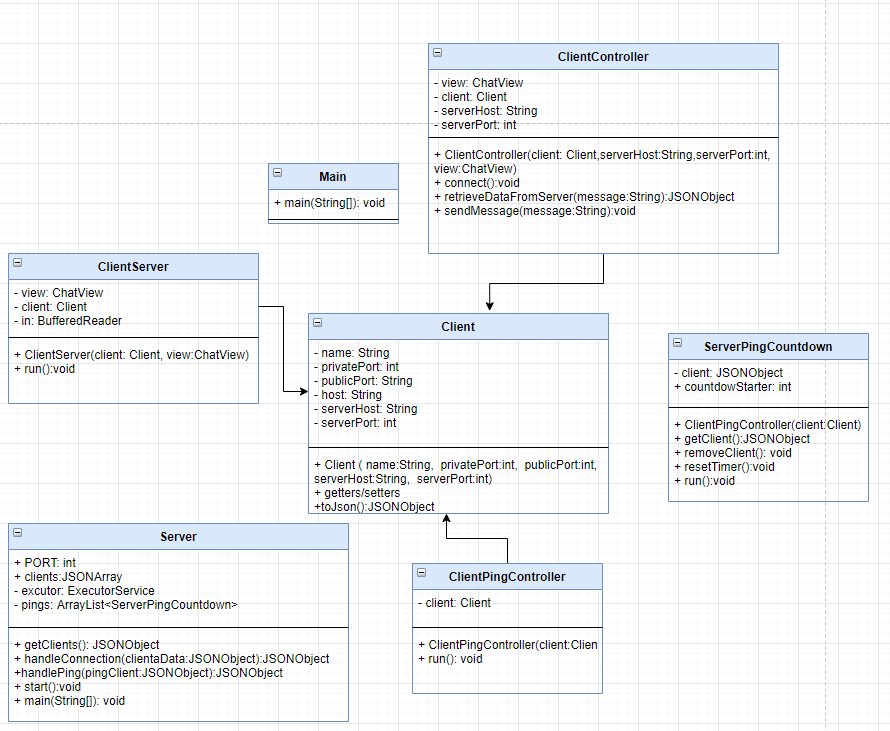

# Sala de bate papo

## Equipe

- **Adrian Grosch**
- **Matheus Parro de Sousa**

## Cenário Base

O sistema consiste numa sala de bate papo peer to peer através de sockets em conjunto com threads. Para entrar na sala,
cada cliente deve informar seu nome de usuário, host e porta de onde está hospedado o servidor, para que o mesmo aceite
a conexão do socket, disparando um aviso "Cliente entrou" para todos os já conectados. Cada cliente logado pode enviar
mensagens a todos os participantes. Tal comunicação acontece através de JSONs com a chave "name" e "message", sendo
respectivamente o nome do cliente que está enviando a mensagem e message o conteúdo digitado pelo menos

A manipulação dos dados é realizada a partir de mensagens recebidas do cliente, via Socket. A mensagem é uma String que
é separada pelo caracter especial ";". Essa String contém, em posições específicas, a operação de manipulação e os dados
requeridos, conforme esquema abaixo.

A aplicação cliente consiste em uma tela principal, que é a do bate papo, onde para cada novo cliente é instanciada uma
Thread chamada MessageListener, que monitora através de um BufferedReader as mensagens recebidas pelos outros clientes.
Tal thread é necessária pois a leitura do Buffered reader interrompe a execução do código até ser recebida uma mensagem,
logo, fica inviável enviar uma nova mensagem outra mensagem seja lida pelo mesmo cliente.; A aplicação servidor mantém
os clientes conectados no socket, ou seja, para cada cliente cuja cojnexão do socket foi aceita, será criada também uma
Thread para despachar uma mensagem de um cliente para outros clientes através de um PrintWriter instanciado a partir do
OutputStream de cada cliente. Esta Thread criada é adicionada num array estático na classe do servidor, para assim saber
quais clientes devem receber uma mensagem enviada por outro cliente.

**REQUISITOS FUNCIONAIS**

 RF1: O Sistema deve permitir conexão com o server socket

 RF3: O sistema deve permitir a troca de mensagens entre varios usuários.
 
 RF3: O sistema deve manters mensagens digitas pelos usuários enquanto o aplicativo estiver aberto.

**JSON DA TROCA DE MENSAGENS ENTRE CLIENTES**

| CHAVE  |  CONTEÚDO  |
| ------------------- | ------------------- |
|  name |  Nome do cliente que está enviando a mensagem |
|  message |  Conteúdo enviado pelo cliente através do input de texto na tela do bate papo |

